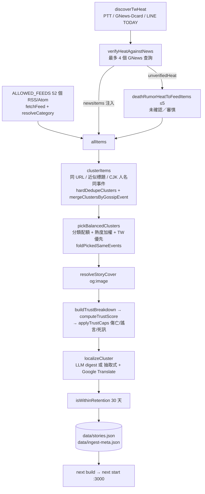

# Axiom 新聞 MVP — 交接文件（給 Muse／Bebo 維護者）

> 分支：`feat/mvp`　Repo：<https://github.com/r85075515/Trust-digest>
> 撰寫日期：2026-10-03（Asia/Taipei）。內容依據 `feat/mvp` 上 commit `849f224` 的**實際程式碼**整理；如與程式碼不符，以程式碼為準。
>
> **重要要求（Ray）：改寫（rewrite／digest）與翻譯不得再使用 xAI。** 請改接 Muse 或免費模型（見第 5 節）。

---

## 1. 架構總覽

Next.js 15（App Router，`src/app`）+ React 19 + Tailwind。**沒有資料庫、沒有後端 API**：每日由離線腳本 `scripts/ingest.ts` 產出 JSON，前端以 `import` 靜態載入。

### 主要目錄／檔案

| 路徑 | 作用 |
|---|---|
| `scripts/ingest.ts` | 每日 ingest 主程式：抓 RSS → 熱源 → 分群 → 挑選 → 封面 → trust → 雙語 digest（LLM 或抽取式＋Google Translate）→ 寫 `data/stories.json`、`data/ingest-meta.json` |
| `src/lib/rss-ingest.ts` | `ALLOWED_FEEDS`（feed allow-list）、`OUTLET_REPUTATION`、`resolveCategory`（分類啟發式）、`clusterItems`／`hardDedupeClusters`／`mergeClustersByGossipEvent`（同事件合併）、`buildTrustBreakdown`、`pickBalancedClusters`（挑卡＋熱度加權）、`foldPickedSameEvents`、`buildExtractiveDigest`、`resolvePublisherDomain`（GNews 轉真實發行者網域） |
| `src/lib/heat-discovery.ts` | 台灣熱源：PTT Gossiping、Dcard（經 GNews proxy）、LINE TODAY；`verifyHeatAgainstNews`、`deathRumorHeatToFeedItems` |
| `src/lib/trust.ts` | trust 分數、各種 cap、死訊謠言分類 `classifyCelebrityDeathRumor`、誠實標籤 `honestyKind`／`honestyLabel` |
| `src/lib/cover.ts` | 封面：抓文章頁 `og:image`／`twitter:image`，排除 hub／列表頁與小縮圖（`isJunkImageUrl`） |
| `src/lib/stories.ts` | **靜態 `import storiesData from "../../data/stories.json"`**；過濾 adult、30 天保留；`getMainStories()` 排除 `society`、`beauty`；`CATEGORY_LABELS` |
| `src/lib/retention.ts` | `RETENTION_DAYS = 30`、`DayRange`（today／7d／30d，today 以台北時區午夜起算） |
| `src/lib/types.ts` | `Story`、`Category`、`TrustBreakdown`、`LocalizedText`（`zh-TW`／`en`）等型別 |
| `src/lib/personalization.ts` | localStorage（`axiom-personalization-v1`）的偏好權重與 `rankStories` |
| `src/app/page.tsx` | 首頁（client component）：分類、日期範圍、頭條、卡片；讀 `data/ingest-meta.json` 顯示「上次更新」 |
| `src/app/story/[id]/page.tsx` | 內頁：完整 digest、來源、分歧、「背景／名詞解釋」glossary、trust breakdown |
| `src/components/` | `CategoryFilter`（主 chips：全部／國際／財經／科技／AI／熱門八卦（可驗證）／東亞八卦）、`DayRangeFilter`、`TrustScoreBadge`（誠實標籤）、`TrustBreakdown`、`StoryCard`、`HeadlineBlock`、`Header`、`InteractionButtons` |
| `src/hooks/` | `useLanguage`、`usePersonalization` |
| `scripts/refresh-covers.ts` | 只重抓指定 story 的封面（不跑 digest、不呼叫 LLM） |
| `scripts/test-celebrity-death-hoax.ts` | 死訊謠言路徑單元測試（無網路、無 LLM） |

### 資料檔

- `data/stories.json`：前端唯一資料來源（`Story[]`）。**每次 ingest 會整檔覆寫**（只含當天挑出的約 10–16 張卡，不會累積歷史）。
- `data/ingest-meta.json`：本次 ingest 統計（`ingestedAt`、`feedOk/feedTotal`、`byCategory`、`heatSourcesShipped`、`heatVerifiedKeywords`、`llmUsed`、`mode`）。最近一次：2026-09-30 09:43（台北），48/52 feeds OK、541 raw items、11 張卡、`mode: llm+rss+heat`。
- `public/covers/live/`：ingest 下載的封面，檔名為 `<storyId>.<ext>`。
- `public/covers/*.jpg`（`int-01.jpg`、`adult-01.jpg`…）：早期 demo 靜態封面，仍被 git 追蹤（見第 6 節）。

### Ingest 流程



說明：程式中沒有獨立的「heat 分數」欄位；**熱度**體現在 `pickBalancedClusters` 的挑選分數（多來源成員數、TW 區域 +24、八卦詞 +14、命中已驗證熱詞每個 +12、死訊詞 +16 等）。`heat-discovery.ts` 裡的 `heatBoostScore` 目前**未被使用**。

---

## 2. 部署與每日排程

### npm scripts（`package.json` 實際內容）

| 指令 | 內容 |
|---|---|
| `npm run dev` | `next dev` |
| `npm run build` | `next build` |
| `npm start` | `next start`（排程用 `npm run start -- -p 3000`） |
| `npm run lint` | `next lint` |
| `npm run ingest` | `tsx scripts/ingest.ts` |
| `npm run refresh-covers` | `tsx scripts/refresh-covers.ts` |
| `npm run test:death-hoax` | `tsx scripts/test-celebrity-death-hoax.ts` |

### 環境變數（`scripts/ingest.ts` → `getLlmConfig()`）

| 變數 | 說明 |
|---|---|
| `AXIOM_LLM_API_KEY` | 主要 LLM key（目前是 xAI）。**Muse 維護者請自備自己 provider 的 key，透過 env 提供；不要寫進 repo 或文件。** |
| `XAI_API_KEY`／`OPENAI_API_KEY` | 舊的備援 key 名稱 |
| `AXIOM_LLM_BASE_URL` | OpenAI 相容 base URL。未設時：若有 `AXIOM_LLM_API_KEY`／`XAI_API_KEY` 或 key 以 `xai-` 開頭 → `https://api.x.ai/v1`，否則 `https://api.openai.com/v1` |
| `AXIOM_LLM_MODEL` | 未設時：base URL 含 `x.ai` → `grok-3-mini`，否則 `gpt-4o-mini` |
| `AXIOM_PICK_MIN`／`AXIOM_PICK_MAX` | 挑卡數量（預設 12／16；程式下限 4）。每日排程用 8／12 |

⚠️ `getLlmConfig()` 在 env 都沒設時，還會呼叫 `loadKeyFromBoxSecrets()` 從 box 本機的一個 secrets JSON 讀 key。這代表**「不設 env」不等於「不呼叫 LLM」**。接手後請刪除這個 fallback（見第 5、8 節）。

### 每日排程（已暫停）

server-side routine「**Axiom 日更**」，每天 **09:32 Asia/Taipei**，**自 2026-09-30 起暫停**。步驟：

1. 小量 ingest：`AXIOM_PICK_MIN=8 AXIOM_PICK_MAX=12 npm run ingest`
2. 只對挑中的 cluster 產 digest（ingest 本身就只對 picked 做 digest）
3. 在 `feat/mvp` commit + push `data/stories.json`、`data/ingest-meta.json`（及 `public/covers/live/`）
4. `npm run build`，重啟 `next start -p 3000`
5. 開 tunnelmole 公開 tunnel：`/home/box/.local/bin/tmole 3000`
6. 自我測試：公開 HTTPS URL 回 200，且頁面上看得到卡片

### 注意事項

- **`stories.json` 是靜態 import**（`src/lib/stories.ts`、`page.tsx` 也 import `ingest-meta.json`），所以 **ingest 之後一定要重新 `next build` 再重啟**，否則網站還是舊資料。
- **tunnelmole 的 URL 是臨時的**，常常斷線、每次重開網址都會變；**目前沒有永久部署**。`next.config.ts` 的 `allowedDevOrigins` 裡寫死了幾個舊 tunnel 主機名（`*.tunnelmole.net`、`*.loca.lt`、`*.trycloudflare.com` 及兩個具體子網域），僅影響 dev 模式。
- **30 天保留**：`RETENTION_DAYS = 30`，ingest 寫檔前與前端載入時都用 `isWithinRetention` 過濾。但因為 ingest 每次**整檔覆寫**，實際上 `stories.json` 只有最近一次跑出來的卡；首頁的「近7天／近30天」並不會顯示過去幾天的卡（見第 6 節）。
- 寫這份文件時（2026-10-03），box 上仍有 `next start -p 3000` 在跑（舊 build），沒有 tunnel。

---

## 3. RSS／熱源來源

`ALLOWED_FEEDS` 共 **52** 個 feed（`src/lib/rss-ingest.ts`）。每個 feed 抓取上限：`eastAsiaGossip` 的 TW = 22 則，jp/kr/cn = 5 則，其他 = 7 則（`maxItemsForFeed`）。

### 國際 international（4）
- BBC World — `https://feeds.bbci.co.uk/news/world/rss.xml`
- NPR World — `https://feeds.npr.org/1004/rss.xml`
- The Guardian World — `https://www.theguardian.com/world/rss`
- NYT World — `https://rss.nytimes.com/services/xml/rss/nyt/World.xml`

### 財經 finance（5）
- CNBC — `https://www.cnbc.com/id/100003114/device/rss/rss.html`
- MarketWatch — `https://www.marketwatch.com/rss/topstories`
- Yahoo Finance — `https://finance.yahoo.com/news/rssindex`
- BBC Business — `https://feeds.bbci.co.uk/news/business/rss.xml`
- The Guardian Business — `https://www.theguardian.com/business/rss`

### 科技 tech（5）
- TechCrunch — `https://techcrunch.com/feed/`
- The Verge — `https://www.theverge.com/rss/index.xml`
- BBC Technology — `https://feeds.bbci.co.uk/news/technology/rss.xml`
- Ars Technica — `https://feeds.arstechnica.com/arstechnica/technology-lab`
- Engadget — `https://www.engadget.com/rss.xml`

### AI（4）
- MIT News AI — `https://news.mit.edu/rss/topic/artificial-intelligence2`
- Wired AI — `https://www.wired.com/feed/tag/ai/latest/rss`
- ScienceDaily AI — `https://www.sciencedaily.com/rss/computers_math/artificial_intelligence.xml`
- Google AI Blog — `https://blog.google/technology/ai/rss/`

### 熱門八卦（可驗證）entertainment — 西方（7）
- Billboard — `https://www.billboard.com/feed/`
- Rolling Stone Music — `https://www.rollingstone.com/music/music-news/feed/`
- TMZ — `https://www.tmz.com/rss.xml`
- Hollywood Life — `https://hollywoodlife.com/feed/`
- Just Jared — `https://www.justjared.com/feed/`
- ET Online — `https://www.etonline.com/news/rss`
- BBC Entertainment — `https://feeds.bbci.co.uk/news/entertainment_and_arts/rss.xml`

### 東亞八卦 eastAsiaGossip（19）
**TW（12）**
- `ettoday-star` ETtoday 影劇 — `https://feeds.feedburner.com/ettoday/star`
- `gnews-tw-ent` Google News TW Entertainment（topic ENTERTAINMENT, zh-TW）
- `ettoday-fashion` ETtoday 時尚 — `https://feeds.feedburner.com/ettoday/fashion`
- `yahoo-tw-ent` Yahoo TW 娛樂 — `https://tw.news.yahoo.com/rss/entertainment`
- `gnews-tw-yule` GNews 搜尋「娛樂」
- `gnews-tw-ettoday-breakup` GNews `site:ettoday.net (分手 OR 復合 OR 婚)`
- `gnews-tw-setn-breakup` GNews `site:setn.com (分手 OR 婚)`
- `gnews-tw-breakup-star` GNews `分手 (藝人 OR 明星)`
- `gnews-tw-reunion-star` GNews `復合 (藝人 OR 明星)`
- `gnews-tw-divorce-star` GNews `(婚變 OR 離婚) (藝人 OR 明星)`
- `gnews-tw-dcard-proxy` GNews `site:dcard.tw 娛樂`
- `gnews-tw-line-ent` GNews `site:today.line.me/tw 娛樂`

**JP（1）**：`gnews-jp-ent` GNews JP「娛樂 OR 明星」
**KR（3）**：`soompi` — `https://www.soompi.com/feed`；`gnews-kr-kpop` GNews KR「K-pop OR 연예」；`koreaboo` — `https://www.koreaboo.com/feed`
**CN（3）**：`sina-ent-hot` 新浪娛樂熱滾 — `https://rss.sina.com.cn/ent/hot_roll.xml`；`sina-ent-all` 新浪娛樂全新聞 — `https://rss.sina.com.cn/news/allnews/ent.xml`；`gnews-cn-ent` GNews CN「娱乐 明星」

### 社會 society（6）— 會被 `resolveCategory` 重新分到 international（或八卦 lane）
- CBS News Crime — `https://www.cbsnews.com/latest/rss/crime`
- Sky News UK — `https://feeds.skynews.com/feeds/rss/uk.xml`
- BBC UK — `https://feeds.bbci.co.uk/news/uk/rss.xml`
- LA Times California — `https://www.latimes.com/california/rss2.0.xml`
- The Guardian UK News — `https://www.theguardian.com/uk-news/rss`
- NPR News — `https://feeds.npr.org/1001/rss.xml`

### 美妝 beauty（2）
- Allure — `https://www.allure.com/feed/rss`
- Fashionista — `https://fashionista.com/.rss/full/`

### 熱源（`src/lib/heat-discovery.ts`）
| 來源 | 做法 |
|---|---|
| PTT Gossiping | `https://www.ptt.cc/bbs/Gossiping/index.html`，帶 `Cookie: over18=1`，抓 index 頁標題（上限 25） |
| LINE TODAY | `https://today.line.me/tw/v2/tab/entertainment` HTML，解析 `__NEXT_DATA__` 標題（上限 20）；若八卦詞命中少於 3 則，fallback 到 GNews `site:today.line.me/tw 娛樂` |
| Dcard | **透過 GNews `site:dcard.tw 娛樂`**（上限 12）；直接打 dcard.tw 會被 Cloudflare 403，程式刻意不抓 |

流程：熱源標題 → `heatQueryTokens` 取關鍵字 → 先比對已抓到的 TW 新聞，再用最多 4 個 GNews 查詢驗證 → 有 ≥2 個新聞網域（或 ≥3 則）視為 verified keyword，新聞注入 ingest pool；未驗證的**死訊類**熱源轉成最多 5 則「社群熱度」item（`deathRumorHeatToFeedItems`），只會拿到 未確認／審慎。

### 已知空的 feed
最近一次 ingest 48/52 feeds 有資料，4 個為 0：
- `sina-ent-hot`、`sina-ent-all`：feed 本身回空／失效。
- `allure`、`fashionista`：**注意**，`resolveCategory` 對 `beauty` 一律 `return null`（美妝暫不使用），所以這兩個 feed 即使有內容也會顯示 0 items。是設計造成的「空」，不一定是 feed 壞掉；目前抓它們只是浪費請求。

---

## 4. Trust score 怎麼算

### 基礎分（`buildTrustBreakdown` in `rss-ingest.ts` + `computeTrustScore` in `trust.ts`）

四項各 0–25，加總後 clamp 0–100：

- **N源 = 不重複的發行者網域**（`uniquePublisherDomains` → `resolvePublisherDomain`）。GNews 包裝的連結會依標題尾綴（「- ETtoday」「三立」「自由」…）或 `site:` feed 的 domain 還原成真實發行者；解析不了的一律歸到 `news.google.com` 單一桶，**絕不**用 slug 灌水 N源。
- `sourceDiversity = min(25, N × 8)`
- `outletReputation = min(25, 平均 OUTLET_REPUTATION)`；未知網域 = 10（例：reuters/apnews 25、bbc 24、npr 23、nytimes 22、cnbc 19、ettoday 13、news.google.com 12、tmz 12、koreaboo 10）
- `crossCorroboration = min(25, 8 + (N−1) × 7)`；若 `detectDisagreement` 偵測到數字不一致 → `max(6, 值 − 8)`
- `recencyClarity`：起始 25；>6h −3、>24h −5、>72h −6、>168h −6；標題+描述總長 <80 −4、>400 +1；clamp 0–25

### Cap（`applyTrustCaps`，ingest 時與 `TrustScoreBadge` 前端都會套用）

| 情況 | 判斷 | 上限 |
|---|---|---|
| 發展中傷亡（死亡／失蹤／犯罪／災難） | `isDevelopingCasualtyText`（`CASUALTY_KEYWORDS`） | `CASUALTY_SCORE_CAP = 55` |
| 未證實八卦／謠言 | `isDevelopingGossipText`（`RUMOR_GOSSIP_KEYWORDS`：allegedly、rumor、reportedly、緋聞、傳、據傳、網傳、疑似、爆料…） | `RUMOR_GOSSIP_SCORE_CAP = 55` |
| 名人死訊 `unconfirmed_rumor` | 見下 | `DEATH_RUMOR_UNCONFIRMED_CAP = 45` |
| 名人死訊 `debunked`／`disputed` | 見下 | `DEATH_RUMOR_DEBUNK_CAP = 55` |
| 名人死訊 `confirmed_obituary` | 見下 | 同傷亡 cap 55 |

### 名人死訊／假死路徑（PR #2「celebrity death-hoax cards」，`classifyCelebrityDeathRumor`）

前提：屬於名人 lane（`entertainment`／`eastAsiaGossip`，或文字含 actor/singer/idol/藝人/男星/女星… 等 `CELEBRITY_LANE_RE`），且含死亡詞或闢謠詞。`mainstreamCount` = `MAINSTREAM_OBITUARY_DOMAINS`（BBC、Reuters、AP、NPR、NYT、Guardian、CBS、CNN、LA Times、UDN、自由、中時、中央社、風傳媒、Yahoo TW、公視、三立、東森、TVBS、Billboard、Rolling Stone、Variety、THR、ET Online…）中不重複發行者數。社群網域（`ptt.cc`、`dcard.tw`、`today.line.me`、reddit、x/twitter、facebook）不算主流。

判斷順序：
1. 有闢謠詞 + 有死亡詞 + 主流 ≥1 → `debunked`
2. 有闢謠詞、無死亡詞 → `debunked`
3. 有闢謠詞 + 有死亡詞 + 主流 = 0 → `disputed`
4. 主流 ≥2 + 死亡詞 → `confirmed_obituary`
5. 主流 = 1 + 死亡詞 + 無謠言語氣 → `confirmed_obituary`
6. 死亡詞 + 主流 = 0 → `unconfirmed_rumor`（≤45）
7. 死亡詞 + 謠言語氣 + 主流 <2 → `unconfirmed_rumor`

測試案例名稱刻意不含任何真實人名（「no person-name hardcode」）。

### 標籤（`honestyKind` → `honestyLabel`）

UI 以**誠實標籤**為主、預設不顯示大數字（`showScore=false`）：

| kind | zh-TW | en | 條件 |
|---|---|---|---|
| `multi_agree` | `N源一致` | N sources agree | N ≥ 2、無分歧、非傷亡／謠言（或 confirmed_obituary 且 N≥2） |
| `single` | `僅1源` | 1 source only | N ≤ 1 |
| `disagree` | `敘述有分歧` | Accounts differ | 有分歧，或 `disputed` |
| `unconfirmed` | `未確認` | Unconfirmed | 傷亡／謠言且 N≤1 或有分歧；`unconfirmed_rumor` 且 N≤1 |
| `cautious` | `審慎` | Cautious | 傷亡／謠言且 N≥2；`unconfirmed_rumor` 且 N≥2；`confirmed_obituary` 且 N≤1 |
| `debunk` | `打臉`／`多源打臉`（N≥2） | Debunked／Multi-source debunk | `debunked` |

顏色刻意用 slate／amber／violet，不用綠色「High trust」。`trustLabel`／`trustColorClass`（High/Moderate/Low）已 deprecated。

---

## 5. 目前呼叫 xAI API 的位置

全 repo 搜尋 `api.x.ai`、`x.ai`、`AXIOM_LLM`、`XAI_API_KEY`、`OPENAI_API_KEY`、`grok`、`openai`、`chat/completions`、`fetch(`、`translate` 的結果：**所有 LLM 呼叫都集中在 `scripts/ingest.ts` 一個檔**，沒有 openai SDK，用原生 `fetch`。前端（`src/`）完全不呼叫 LLM。

| 檔案：函式 | 用途 |
|---|---|
| `scripts/ingest.ts: getLlmConfig()` | 決定 key／base URL／model。預設 `https://api.x.ai/v1` + `grok-3-mini`。內含 `loadKeyFromBoxSecrets()` fallback（讀 box 本機 secrets 檔）。 |
| `scripts/ingest.ts: llmDigest()` | **唯一的 LLM HTTP 呼叫**：`POST ${baseUrl}/chat/completions`，`temperature: 0.2`，先帶 `response_format: {type:"json_object"}`，遇 400 再不帶重試。一次呼叫同時產出：英文標題／摘要／內文（**改寫 rewrite／digest**）、**zh-TW 翻譯**（`title_zh_TW`、`summary_zh_TW`、`body_zh_TW`、`disagreements_zh_TW`）、**glossary**（3–8 個名詞，`term_*`／`blurb_*`，用於「背景／名詞解釋」）。每張被挑中的卡呼叫一次（每日約 8–12 次）。 |
| `scripts/ingest.ts: localizeCluster()` | 呼叫 `llmDigest()`；LLM 失敗或沒 key 時改走 `buildExtractiveDigest()` + `translateToZhTW()`。 |
| `scripts/ingest.ts: main()` | 對每個 picked cluster 呼叫 `localizeCluster(c, llm)`。 |

- **Prompt 位置**：`scripts/ingest.ts` 的 `llmDigest()` 內，`const prompt = \`You are Axiom's news digest writer…\``（約第 357–377 行）＋ system message `"You output only valid JSON. Never invent news facts."`。Prompt 內含分類指引、禁止原始 URL、`譯名（Original）` 格式、glossary 規格。
- **非 LLM 翻譯**：`scripts/ingest.ts: translateToZhTW()` 使用 `@vitalets/google-translate-api`（非官方免費 Google Translate 端點，非 xAI）。用途：(a) 無 LLM 時翻譯抽取式 digest；(b) LLM 回傳缺 zh 欄位時補翻。失敗時回 `null`，畫面顯示「（譯文待補）」＋英文。
- 其他：`OPENAI_API_KEY` 只是 env 名稱；`rss-ingest.ts` 裡的 `"openai"` 只是熱門關鍵字／網域聲譽，不是 API 呼叫。

### 遷移建議（Ray 要求：改寫與翻譯不再使用 xAI）

1. **新增 provider 無關的 wrapper**，例如 `src/lib/llm.ts`：
   ```ts
   // 由 env 選擇；OpenAI 相容 /chat/completions
   export interface LlmConfig { baseUrl: string; model: string; key?: string; provider: string }
   export function getLlmConfig(): LlmConfig | null   // 讀 AXIOM_LLM_PROVIDER / AXIOM_LLM_BASE_URL / AXIOM_LLM_MODEL / AXIOM_LLM_API_KEY
   export async function chatJson(cfg: LlmConfig, messages, opts?): Promise<unknown | null>
   ```
   - 新增 `AXIOM_LLM_PROVIDER`（例 `muse`／`openrouter`／`ollama`／`none`），`none` = 強制不呼叫 LLM。
   - **移除所有 xAI 預設值**（`https://api.x.ai/v1`、`grok-3-mini`、`key.startsWith("xai-")` 判斷）與 `loadKeyFromBoxSecrets()`；沒有明確設定 base URL + model 時不呼叫任何 LLM。
   - 可加 guard：`baseUrl` 含 `x.ai` 時直接 throw，避免誤用。
   - key 一律只從 env 讀；Muse 維護者自備 provider key。
2. **拆開改寫與翻譯**（目前一次 prompt 做完）：`digestEn()`（英文改寫＋glossary）與 `translateZh()`（翻譯成 zh-TW，含 `譯名（原文）` 規則），各自可指定不同 provider／model（例如 `AXIOM_TRANSLATE_PROVIDER`）。這樣翻譯可以用便宜／免費模型或 Muse，改寫用另一個。
3. **候選替代**：Muse（由協調者提供 OpenAI 相容 endpoint）、OpenRouter 的免費模型、本機 Ollama（`http://localhost:11434/v1`）等，只要是 OpenAI 相容 `/chat/completions` + JSON 輸出即可。部分免費模型不支援 `response_format`，現有「400 時不帶 response_format 重試」邏輯要保留，並加上從文字中擷取 JSON 的容錯。
4. Google Translate fallback（`@vitalets/google-translate-api`）可保留作最後備援，但它不穩定（見第 6 節），也不會產生 `譯名（原文）` 格式與 glossary。
5. 在 `ingest-meta.json` 記錄實際使用的 provider／model（目前只有 `llmUsed: boolean`）。

---

## 6. 已知 bug

1. **標題中英混雜**：zh 標題仍常見中英夾雜，且有冗餘 `OpenAI（OpenAI）`、`JYP（JYP）`；台灣藝人被寫成拼音原文，如 `唐綺陽（Tang Qiyang）`（台灣人名不需要附拼音）。根源在 prompt 的 `譯名（Original）` 規則一律套用。
2. **偶爾分錯類**：例如南非槍擊案被標成 entertainment。原因：`resolveCategory` 對 `feedCategory === "entertainment"` 的 item **一律回傳 entertainment**（只過濾 `ENTERTAINMENT_NEGATIVE`），不看 crime 詞；`buildClusterFromMembers` 的 `pureWesternEnt` 也會把純娛樂 feed 的 cluster 鎖在 entertainment。2026-09-30 資料也有同類：「Caleb Flynn 謀殺妻子案」、「Ana Montana 毒品被捕」在 entertainment。`SOCIETY_POSITIVE`／`SOCIETY_NEGATIVE` 已定義但**沒有被使用**（lint 警告）。
3. **有些 digest 產出了卻沒進最終 stories**：已知路徑之一是 retention 過濾在 digest **之後**才做（`main()` 先 `localizeCluster` 再 `isWithinRetention`），超過 30 天的 cluster 會白花 LLM 呼叫後被丟掉；其餘原因尚未查明，建議在 digest 前先過濾，並在 log 中記錄每個被丟掉的 id 與原因。
4. **Google Translate premature close**：`@vitalets/google-translate-api` 常拋 `Premature close`／被限流，`translateToZhTW` 回 `null` → 畫面出現「（譯文待補）」＋英文。
5. **空 feed**：`sina-ent-hot`、`sina-ent-all` 回空；`allure`、`fashionista` 因 beauty 被 `resolveCategory` 丟棄而顯示 0（見第 3 節）。
6. **只有 GNews 來源的卡沒有封面**：GNews RSS 沒有 media 圖，連結是 `news.google.com` 轉址，`fetchArticleCover` 拿不到真正文章的 `og:image`。另外 `coverBudget` 上限 16。
7. **原生 Dcard 403**：dcard.tw 走 Cloudflare，直接抓會 403，目前只靠 GNews `site:dcard.tw` proxy。
8. **純社群假死謠言只部分涵蓋**：只有 PTT／GNews-Dcard／LINE TODAY 標題 + 死訊 regex；Threads／X／FB 的謠言抓不到；`deathRumorHeatToFeedItems` 每次最多 5 則。
9. **舊封面殘留**：`git stash@{0}`（"On feat/celebrity-death-hoax: temp covers before daily switch 2026-09-25"）存了 44 個舊 `public/covers/live/*` 檔，**不要 pop**。寫這份文件時工作目錄沒有 untracked 檔案，但每天 ingest 會在 `public/covers/live/` 產生新檔，舊檔不會被清掉。
10. **（新發現）關鍵字子字串誤判**：`isDeathRumorText`、`isDevelopingCasualtyText` 用 `includes()` 比對英文詞，`"rip"` 會命中 trip／script，`"dead"` 會命中 deadline。實測：`classifyCelebrityDeathRumor({category:"entertainment", texts:["Taylor Swift script for new tour"], domains:["billboard.com"]})` 回傳 `confirmed_obituary`（分數被壓到 55）。中文 `RUMOR_GOSSIP_KEYWORDS` 的單字「傳」也會命中「傳統」等詞，很多 TW 卡因此被壓在 55。應改為字邊界比對（`rss-ingest.ts` 的 `includesAny` 已有 boundary 寫法可參考）。
11. **（新發現）stories.json 每天整檔覆寫，不累積**：近 7 天／30 天 filter 實際上只顯示最近一次 ingest 的 10–11 張卡；`isWithinRetention` 形同虛設。若要真正 30 天保留，ingest 需要讀舊檔 merge 再過濾。
12. **（新發現）story id 依當日位置產生**：`live-<category>-<NN>-<slug>`，隔天同 id 可能變成另一則新聞，舊連結會指錯；封面檔也以 id 命名，會被覆寫。
13. **（新發現）前端 badge 會重算 cap**：`TrustScoreBadge` 以畫面上的 title+summary（含 LLM 產生的中英文字）重新判斷傷亡／謠言／死訊，可能與 ingest 存的 `trustScore` 不一致。
14. **（新發現）`deathRumorHeatToFeedItems` 的 LINE fallback 連結**是 `https://today.line.me/tw/v2/tab/entertain`（少了 `ment`）。
15. **（新發現）**無 env 時 `loadKeyFromBoxSecrets()` 仍會讀 box 本機 secrets 並呼叫 xAI（見第 2、5 節）。`README.md` 也提到這個 fallback，建議一併從 README 移除相關描述。
16. **lint 警告**（`npm run lint` 無 error）：`` 未用 `next/image`（`HeadlineBlock`、`StoryCard`）、`_drop` 未使用（`personalization.ts`）、`SOCIETY_POSITIVE`／`SOCIETY_NEGATIVE` 未使用。
17. `public/covers/adult-0{1,2,3}.jpg` 等早期 demo 封面仍被 git 追蹤（成人分區已永久移除，沒有程式引用；可考慮刪除，但請先問）。

---

## 7. 未完成的事／backlog

- **Threads／X 熱度來源**（`heat-discovery.ts` 註明 backlog，未實作）
- **原生 Dcard API**（目前只有 GNews proxy）
- **更完整的 LINE TODAY**（多 tab 爬取；目前只抓 entertainment tab 的 `__NEXT_DATA__`），以及更多 PTT 看板
- **永久 hosting** 取代 tunnelmole 臨時 tunnel
- **LLM provider 遷移**：離開 xAI，改用 Muse／免費模型（第 5 節）——**優先**
- stories.json 累積 + 30 天保留、穩定 story id（第 6 節 #11、#12）
- 關鍵字比對改字邊界（第 6 節 #10）
- **AdSense／改名：暫緩，除非 Ray 要求，否則不要做**
- **美妝 beauty／社會 society 預設隱藏**：`getMainStories()` 排除、`CategoryFilter` 不顯示、`pickBalancedClusters` 配額 0、beauty 在 `resolveCategory` 直接丟棄。維持現狀，除非另有指示。

---

## 8. 本機測試方法

```bash
cd Trust-digest
git checkout feat/mvp
npm install

npm run dev              # http://localhost:3000（讀現有 data/stories.json）
npm run build && npm start -- -p 3000
npm run lint             # 目前只有 warning

npm run test:death-hoax  # 死訊謠言路徑單元測試，無網路、無 LLM（目前 12 checks passed）
```

- **只重抓封面（不呼叫 LLM）**：`npx tsx scripts/refresh-covers.ts <storyId> [storyId...]`（不帶參數時會挑預設範例＋最多 2 則缺封面的卡）。會改寫 `data/stories.json` 的 `imageUrl` 與 `public/covers/live/`，之後要 rebuild。
- **無 LLM／dry check**：目前**沒有** `--dry-run` 旗標。⚠️ 就算 unset 所有 `AXIOM_LLM_*`／`XAI_API_KEY`／`OPENAI_API_KEY`，`loadKeyFromBoxSecrets()` 仍可能從 box 本機讀到 key 而呼叫 xAI。**在移除該 fallback 之前，不要在 box 上執行 `npm run ingest`**。移除後，不設 key 的 ingest 會走「抽取式 digest + Google Translate」（log 顯示 `no LLM key — extractive digests + free zh-TW translate`），不花 LLM token。建議遷移時一併加入 `AXIOM_LLM_PROVIDER=none` 與 `--dry-run`（只抓 feed／分群／挑卡並印出結果，不寫檔、不 digest）。
- **接好新 provider 後跑小量 ingest**：
  ```bash
  export AXIOM_LLM_BASE_URL=<你的 OpenAI 相容 endpoint>   # 不可是 api.x.ai
  export AXIOM_LLM_MODEL=<model>
  export AXIOM_LLM_API_KEY=<由 Chief of Staff 提供，只放 env>
  AXIOM_PICK_MIN=4 AXIOM_PICK_MAX=4 npm run ingest       # 程式下限 4
  cat data/ingest-meta.json                              # 確認 llmUsed / mode
  npm run build && npm start -- -p 3000
  ```
  確認 log 中 `LLM enabled (<baseUrl>, model <model>)` 的 baseUrl **不是** `api.x.ai`。

---

## 9. 產品規則（不要破壞）

1. **一個事件一張卡**：同 URL、近似標題、CJK 同人名同事件都要合併（`clusterItems` → `hardDedupeClusters` → `mergeClustersByGossipEvent` → `foldPickedSameEvents`）。
2. **不同分類之間不得出現重複 URL／近似重複**（`hardDedupeClusters` 的 `usedUrls`）。
3. **誠實的 trust**：用 `N源一致／僅1源／敘述有分歧／審慎／未確認／打臉`，**絕不**用「高信任」之類的行銷語；N源 = 不重複發行者網域；傷亡、謠言、死訊都要 cap。
4. **摘要／內文不放原始 URL**（`stripRawUrls`；連結只放在 `sources[]`）。
5. **中文人名／組織寫成 `譯名（原文）`**，例：`山姆·奧特曼（Sam Altman）`（但請修正第 6 節 #1 的冗餘問題）。
6. **glossary 區塊標題為「背景／名詞解釋」**（`story/[id]/page.tsx`），每條只寫身分／角色，不編造生平。
7. **不得寫死名人必選**（no hardcoded celebrity must-selects）；死訊路徑全靠 pattern，測試會檢查 trust 模組沒有寫死人名。
8. **成人內容已永久移除**（`adult` 永遠 false，`stories.ts` 會再過濾）。不要加回。
9. **台灣熱度權重 ≫ 日／韓／中**：TW feed 上限 22 vs jp/kr/cn 5；挑卡 TW +24、jp/kr/cn −10；保留 ≥3 個 TW 東亞八卦名額。
10. 只摘要＋連結，絕不轉載全文；LLM 不得編造來源沒有的事實。

---

## 10. 聯絡與權限

- **API key、權限、帳號存取一律透過 Chief of Staff 申請，不要直接找 Ray。**
- key 只能放在 env，不得 commit 進 repo、不得寫進文件、log 或 issue。
- 產品方向（AdSense、改名、開放 beauty／society 等）需 Ray 透過協調者明確同意才能做。
